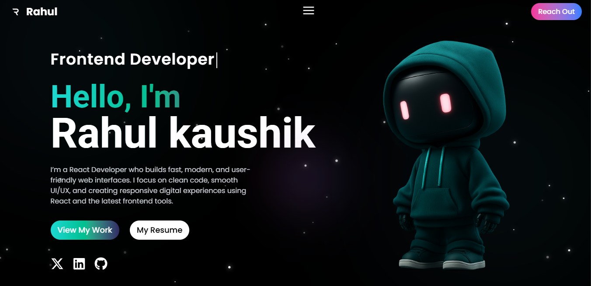
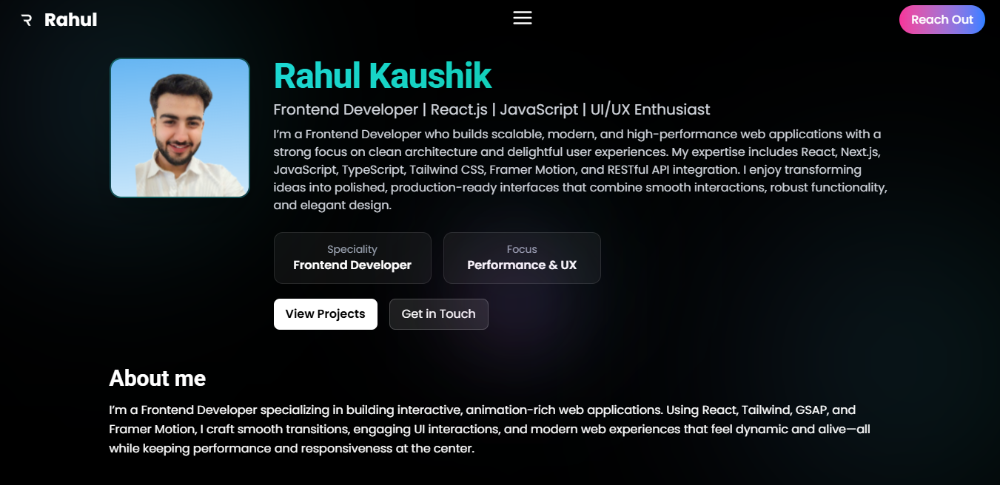
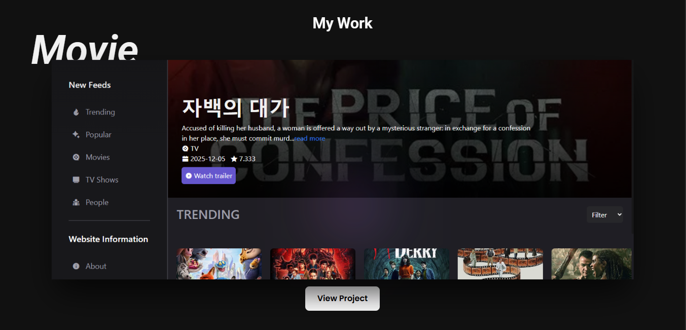
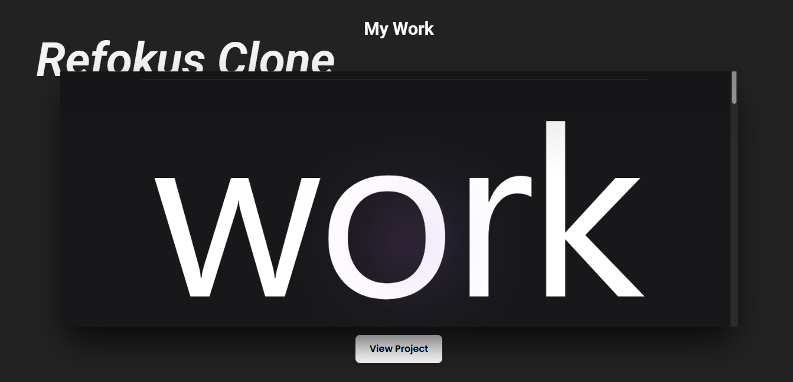
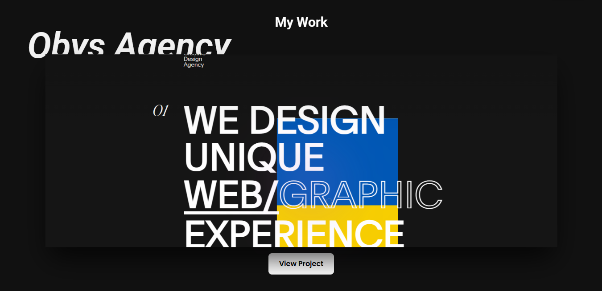
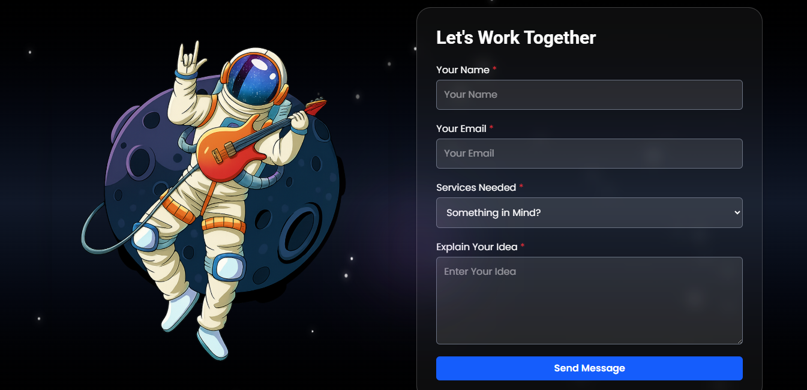

# 🚀 Rahul Kaushik — Frontend Developer Portfolio

A modern, animated, and fully responsive personal portfolio website built with React and Tailwind CSS. This project showcases my frontend development skills, UI/UX focus, real-world projects, and smooth animations with a premium dark-themed design.

Designed to impress recruiters and clients with clean architecture, performance-first UI, and production-ready integrations.

🌐 Live Demo
https://portfolio-ten-eta-dgiw3yl9gl.vercel.app/

## 📸 Project Screenshots

### 🏠 Home Section

---

### 👨‍💻 About Section

---

### 🛠️ Skills Section

---

### 🎬 Movie App Project

---

### 🎨 Refokus Clone

---

### 🏢 Obys Agency Clone

---

### 📩 Contact Section

---

### 🔻 Footer

✨ Key Features

⚡ Modern & premium dark UI

🎨 Clean UI/UX with smooth animations

🧭 Multi-page routing with React Router

🎥 Framer Motion powered transitions

📱 Fully responsive (mobile, tablet, desktop)

📩 Functional contact form using EmailJS

🧠 Clean, scalable component architecture

🚀 Optimized performance & accessibility

🛠️ Tech Stack
Technology	Usage
React.js	Component-based UI
Tailwind CSS	Utility-first styling
React Router DOM	Client-side routing
Framer Motion	Animations & transitions
React Icons	Icon library
EmailJS	Contact form email service

👨‍💻 About Me

Rahul Kaushik
Frontend Developer | React.js | UI/UX Enthusiast

I specialize in building interactive, animation-rich, and scalable web applications using modern frontend technologies. I focus on performance, clean code, and delightful user experiences.

🔗 Connect With Me

🌐 Portfolio: https://your-portfolio-link.vercel.app

🐙 GitHub: https://github.com/Rahul-kaushik15

💼 LinkedIn: https://www.linkedin.com/in/rahul-kaushik-06a664319/

✉️ Email: kaushikrahul1504@gmail.com
